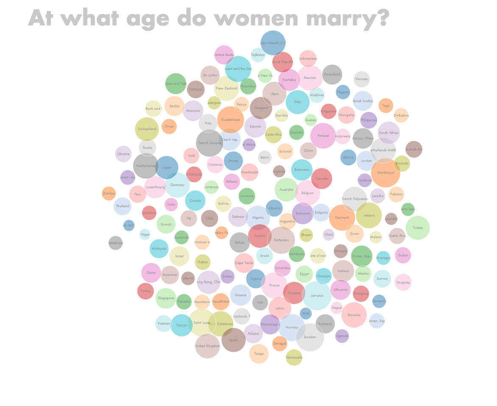
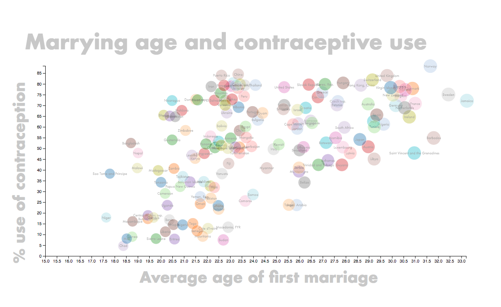

In order to view this project, you will need to use a webserver such as Webstorm. In my case using Webstorm, I opened the project and selected my index.html file, then clicked 'View', then 'Open in Browser'. I don't believe there will be any difference between browsers, but I once encountered some trouble opening in Chrome, and had to restart Chrome to view my project there. There's no need to compile or configure my project. 

To summarize my project, I created two D3 charts from scratch using data, in csv format, that contains information for all countries about the average age of women's first marriage and the percentage of women aged 15 - 40 who use contraceptives. I found this data on Gapminder http://www.gapminder.org/data/, a website that collects statistics to further global development.

You should see a round blob of circles titled 'At what age do women marry?' and a scatterplot below titled 'Marrying age and contraceptive use'. On mouseover of the bubbles, you should see a tooltip displaying country name and average age of new brides for the first bubble chart, and country, age, and rate of contraceptive use for the scatterplot. 

I have to ask that you open my project in a browser window on a 13" Mac laptop for the best experience. This is because although I came close to making my scatterplot perfectly resizeable, the final product is still off balance. Now, it's not possible to open my project in a much larger or smaller window and see the bubbles line up perfectly with their corresponding axis values.  

Just a note that in my project folder I've included the whole D3 library, but that's just a back up, since in the html there's a link to the latest release on the D3 website. If there's some kind of error when running my project that D3 cannot be found, you could try replacing the link in my html with 

For this project, I used the online version of Interactive Data Visualization for the Web, found on the CS171 website, as my primary source of information http://shop.oreilly.com/product/0636920037316.do . 
